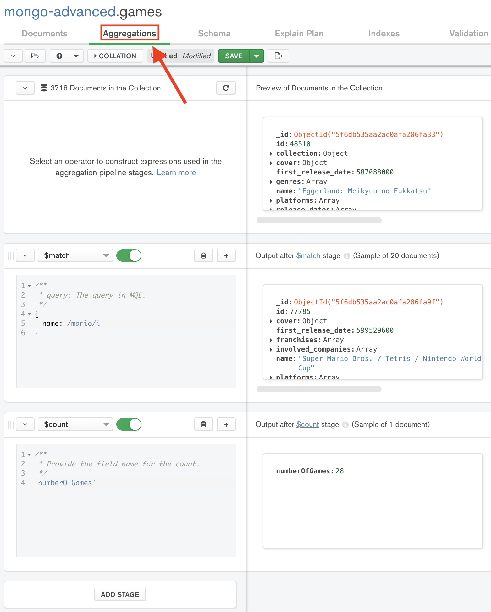

# Play with aggregations

When we provide users with large amount of data, we also need to provide them with search functionalities.
It's also quite common to format the data, depending on what we want to present as a result.

## Specs

In this exercise you have to create this search feature!

### Search

You have to complete the `search` function in `src/games.ts`.
This function should take **three parameters**:
- `db`: the MongoDb database instance
- `query`: the query we want to search for, e.g:
  ```typescript
    const search = { name: /mario/i }
    // or
    const search = { platforms: { $in: [8, 9] } }
    // or
    const search = {"genres.name": /puzzle/i }
  ```
- `aggregation`: the aggregation pipeline, default to`[]`.

In an aggregation pipeline, the search query **should** be in first place and uses the `$match` stage like this:

```typescript
const query = { name: /mario/i }
const pipeline = [
  {
    $match: query
  },
  // the other stages
]
```
> 🔎 You will need to use the **spread operator** here 😉

Your `search` function must return an array of results.

Types are provided to you at the top of the file:

```typescript
import { Db } from "mongodb";

type Aggregation = Record<string, unknown>[];

type Results = Record<string, unknown>[];

type SearchQuery = {
  [key: string]: unknown;
};
```
> Use them when defining you function!
> You can have a look inside `src/index.ts` to see how we want to call the function to use it.

### Aggregations

It's not finished yet!

Look in the `src/pipelines.ts` file. You need to write two aggregations pipelines.

To help you, don't hesitate to use MongoDb Compass, like this:


> Aggregation pipeline example:
> - The first stage, `$match` searches for games with `mario` in the name.
> - The second stage, `$count` counts the results

Here's the 📚 [stages documentation](https://docs.mongodb.com/manual/reference/operator/aggregation-pipeline/) 📚.

#### Thumbnails

You need to write an aggregation formating the result like this for each game:

```typescript
[
  {
    name: "Super Mario Bros. / Tetris / Nintendo World Cup",
    summary: "A compilation of Super Mario Bros. / Tetris / Nintendo World Cup for NES",
    url: "https://www.igdb.com/games/super-mario-bros-slash-tetris-slash-nintendo-world-cup",
    coverUrl: "//images.igdb.com/igdb/image/upload/t_thumb/co22nv.jpg",
  },
  // ...
]
```

The stage to use here is `$project` 😉.

#### groupedByPlatform

Each game has a `platforms` key like this:

```typescript
{
  name: "...",
  platforms: [5, 6]
}
```
> This game has been released on two games console, the one with `id: 5` and the one with `id: 6`.

To group them by platform, you first have to use the `$unwind` stage to duplicate the game for each platform.

Once it's done, use the `$group` stage!
When you will need to `$push` a game inside the `games` property, use `$push: "$$ROOT"`. `$$ROOT` means the whole game object.

## Yarn tests

Once again, use `yarn test` to test your code.

You can also play with `src/index.ts` and `yarn start`!

## MONGODB DATABASE URL

Don't forget to:

- 1️⃣ Create a `.env_vars` file
- 2️⃣ **BE EXTRA SURE** that it is added to your `.gitignore` file to avoid revealing your password on Github on a push.
- 3️⃣ add the database url in the `.env_vars` file:

  ```bash
  export MONGODB_DATABASE_URL=<your-mongo-db-atlas-url>
  ```
  > Change the placeholder with your own url.

- 4️⃣ source your file:

  ```bash
  source .env_vars
  ```
